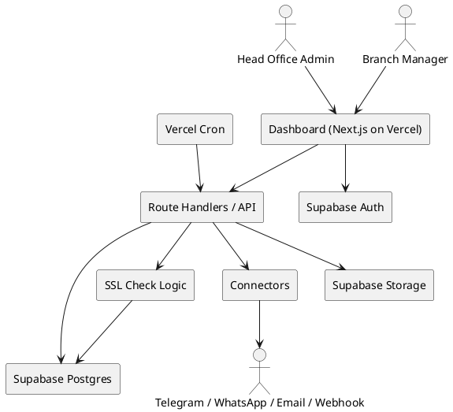
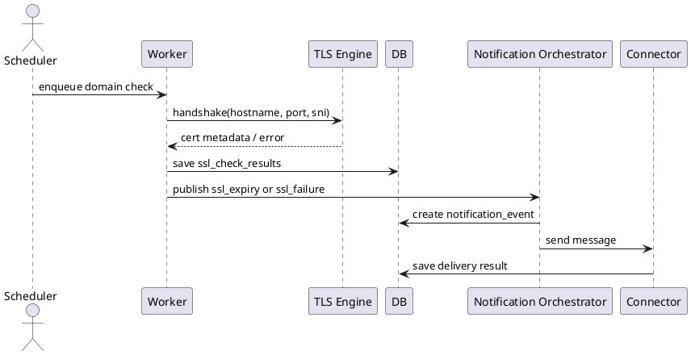
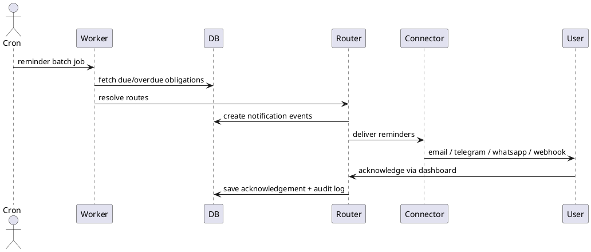

# SPEC-001-Hyperlocal Compliance Reminder OS + SSL Certificate Expiry Monitoring

## Background

একটি সিস্টেম দরকার যা ছোট ব্যবসা, এজেন্সি, বা লোকাল সার্ভিস অপারেটরদের compliance deadline এবং website SSL certificate expiry proactively monitor করে reminder/alert পাঠাবে।

প্রাথমিক ধারণা:
- Hyperlocal compliance বলতে city/zone/market-specific permit, trade license, tax filing, fire safety renewal, local authority deadline বোঝানো হতে পারে
- SSL monitoring বলতে domain বা web service endpoint-এর certificate expiry, issuer, SAN mismatch, renewal failure risk detect করা বোঝানো হতে পারে
- MVP-তে dashboard + scheduled checks + notification pipeline থাকলে usable system বানানো সম্ভব

## Requirements

### Must have
- System must support multiple businesses, with each business having multiple branches
- System must support Bangladesh city/corporation-based compliance rules in MVP, with data model extensible to multi-country use later
- System must store branch-specific compliance obligations such as trade license renewal, tax/VAT filing, fire safety renewal, environmental permit, and inspection renewal
- System must support branch-level due dates, grace periods, escalation rules, and responsible owners
- System must monitor SSL certificate expiry for one or more domains/subdomains per business
- System must detect key SSL attributes including expiry date, issuer, CN/SAN coverage, and last successful check time
- System must send reminders before due dates and before SSL expiry through connected channels
- Users must be able to connect notification destinations from external apps/services so alerts are delivered there
- MVP notification channels: email, WhatsApp, Telegram, and in-app/dashboard notifications
- System must support role-based access for head office admin, branch manager, and operator/compliance staff
- Dashboard must show upcoming deadlines, overdue items, SSL risks, acknowledgement state, and per-branch status
- System must keep immutable audit logs of reminders sent, user acknowledgements, due-date changes, and admin actions
- System must support configurable reminder cadence such as 30/14/7/3/1 days before deadline and same-day escalation

### Should have
- System should support document attachments for each compliance item, such as license PDF, receipt, permit scan, and renewal evidence
- System should support templates for common compliance rules per city, region, or branch type within Bangladesh
- System should support recurring obligations with auto-regeneration after completion
- System should support notification routing by severity, branch, business unit, and channel preference
- System should support webhook-based outbound notifications to connected internal apps
- System should provide CSV/Excel export for upcoming and overdue compliance items
- System should support branch health score based on overdue count, criticality, and SSL posture

### Could have
- System could ingest obligations from spreadsheets, ERP, or ticketing tools
- System could support OCR/document parsing to prefill compliance metadata from uploaded files
- System could support auto-discovery of domains and SSL endpoints from DNS or cloud inventory
- System could support multilingual reminders and localized deadline text
- System could support AI-assisted risk summaries for head office teams

### Won't have in MVP
- Automatic legal interpretation of changing regulations
- Fully automated compliance filing with government portals
- Full contract lifecycle management
- Broad cybersecurity scanning beyond SSL certificate checks

## Method

### Solution shape

MVP will be a multi-tenant web platform with four core capabilities:
1. Compliance registry per business and branch
2. Reminder scheduling and escalation engine
3. SSL certificate monitoring for public domains/subdomains
4. Multi-channel notification delivery to connected apps

Recommended implementation pattern:
- Frontend + server functions: Next.js on Vercel
- Authentication: Supabase Auth
- Database: Supabase Postgres
- File storage: Supabase Storage
- Scheduling: Vercel Cron for application jobs
- Job orchestration: Postgres-backed job tables with idempotent processing
- Deployment: Vercel for app/runtime, Supabase for data plane

This method intentionally combines patterns used by:
- SSL monitoring tools like UptimeRobot / Site24x7: periodic endpoint checks + expiry alerts
- Compliance platforms like Vanta / Drata: evidence tracking, workflows, continuous remindering, auditability

### Architecture

#### Core services
- App/API layer (Next.js Route Handlers on Vercel)
  - session handling, RBAC enforcement, CRUD APIs, reporting APIs, signed connector callbacks
- Compliance Engine
  - obligation creation, recurrence generation, escalation state, branch risk scoring
- SSL Monitor Engine
  - DNS/hostname normalization, TLS handshake, certificate parsing, expiry computation, check result persistence
- Notification Orchestrator
  - resolves routes, templates, deduplication fingerprints, retries, acknowledgement links
- Connector Adapters
  - Email adapter
  - Telegram Bot adapter
  - WhatsApp Business adapter
  - Generic Webhook adapter
- Scheduled Job Layer
  - Vercel Cron triggers reminder, SSL, retry, digest, and recurrence endpoints
  - endpoints claim pending jobs from Postgres using idempotent fingerprints and row locking
- Dashboard UI
  - head-office views, branch views, due soon, overdue, SSL risk, connector health, audit timeline

#### Deployment units
- `vercel-app`: Next.js UI + Route Handlers + cron endpoints
- `supabase-auth`: managed authentication and session issuance
- `supabase-postgres`: primary relational datastore
- `supabase-storage`: license PDFs / permits / evidence attachments
- `external-connectors`: SMTP provider, Telegram Bot API, WhatsApp provider, customer webhook endpoints

### High-level flow



### Domain model

#### Tenant hierarchy
- Tenant = one customer business group
- Branch = physical or operating location under a tenant
- Jurisdiction = country > division > city/corporation > ward/zone (optional depth)
- Obligation Template = reusable definition of a compliance rule
- Obligation Instance = actual due item for a branch

#### Main entities

##### tenants
- `id` UUID PK
- `name` varchar(200)
- `status` enum(`active`,`suspended`)
- `default_timezone` varchar(64) default `Asia/Dhaka`
- `created_at`, `updated_at`

Indexes:
- unique on `name`

##### branches
- `id` UUID PK
- `tenant_id` UUID FK -> tenants
- `code` varchar(50)
- `name` varchar(200)
- `address_line` text
- `city_corporation` varchar(120)
- `district` varchar(120)
- `region` varchar(120)
- `country_code` char(2) default `BD`
- `status` enum(`active`,`inactive`)
- `created_at`, `updated_at`

Indexes:
- unique (`tenant_id`,`code`)
- index (`tenant_id`,`city_corporation`)

##### users
- `id` UUID PK
- `tenant_id` UUID FK
- `email` varchar(255)
- `full_name` varchar(160)
- `password_hash` text
- `status` enum(`invited`,`active`,`disabled`)
- `last_login_at`
- `created_at`, `updated_at`

Indexes:
- unique (`tenant_id`,`email`)

##### roles
- `id` UUID PK
- `tenant_id` UUID FK nullable for system roles
- `name` varchar(80)
- `scope` enum(`system`,`tenant`,`branch`)

##### user_role_assignments
- `id` UUID PK
- `user_id` UUID FK
- `role_id` UUID FK
- `branch_id` UUID FK nullable

##### jurisdictions
- `id` UUID PK
- `country_code` char(2)
- `region` varchar(120) nullable
- `district` varchar(120) nullable
- `city_corporation` varchar(120) nullable
- `zone` varchar(120) nullable
- `label` varchar(250)

Index:
- index (`country_code`,`city_corporation`)

##### obligation_templates
- `id` UUID PK
- `tenant_id` UUID FK nullable (null = system default)
- `jurisdiction_id` UUID FK nullable
- `category` enum(`trade_license`,`fire_safety`,`tax_vat`,`environmental_permit`,`inspection_renewal`)
- `title` varchar(200)
- `description` text
- `recurrence_type` enum(`annual`,`semiannual`,`quarterly`,`monthly`,`custom`)
- `default_lead_days` int default 30
- `default_grace_days` int default 0
- `severity` enum(`low`,`medium`,`high`,`critical`)
- `is_active` boolean
- `metadata_json` jsonb

Indexes:
- index (`category`,`jurisdiction_id`)
- index (`tenant_id`,`is_active`)

##### obligation_instances
- `id` UUID PK
- `tenant_id` UUID FK
- `branch_id` UUID FK
- `template_id` UUID FK nullable
- `category` enum(...same as template)
- `title` varchar(200)
- `owner_user_id` UUID FK nullable
- `status` enum(`upcoming`,`due_today`,`overdue`,`completed`,`waived`)
- `severity` enum(`low`,`medium`,`high`,`critical`)
- `due_at` timestamptz
- `grace_until` timestamptz nullable
- `completed_at` timestamptz nullable
- `recurrence_rule` varchar(120) nullable
- `source` enum(`template`,`manual`,`import`,`api`)
- `notes` text nullable
- `created_at`, `updated_at`

Indexes:
- index (`tenant_id`,`branch_id`,`status`,`due_at`)
- index (`tenant_id`,`category`,`due_at`)
- index (`owner_user_id`,`status`)

##### obligation_documents
- `id` UUID PK
- `obligation_instance_id` UUID FK
- `storage_key` varchar(500)
- `filename` varchar(255)
- `mime_type` varchar(120)
- `size_bytes` bigint
- `uploaded_by_user_id` UUID FK
- `created_at`

##### domains
- `id` UUID PK
- `tenant_id` UUID FK
- `branch_id` UUID FK nullable
- `hostname` varchar(255)
- `port` int default 443
- `sni_hostname` varchar(255)
- `status` enum(`active`,`paused`,`deleted`)
- `last_checked_at` timestamptz nullable
- `next_check_at` timestamptz nullable
- `created_at`, `updated_at`

Indexes:
- unique (`tenant_id`,`hostname`,`port`)
- index (`tenant_id`,`next_check_at`)

##### ssl_check_results
- `id` UUID PK
- `domain_id` UUID FK
- `checked_at` timestamptz
- `check_status` enum(`ok`,`warning`,`expired`,`handshake_failed`,`dns_failed`,`timeout`,`hostname_mismatch`)
- `valid_from` timestamptz nullable
- `valid_to` timestamptz nullable
- `issuer_cn` varchar(255) nullable
- `subject_cn` varchar(255) nullable
- `san_json` jsonb nullable
- `days_remaining` int nullable
- `fingerprint_sha256` varchar(128) nullable
- `error_message` text nullable
- `raw_json` jsonb nullable

Indexes:
- index (`domain_id`,`checked_at desc`)
- index (`check_status`,`checked_at desc`)

##### connectors
- `id` UUID PK
- `tenant_id` UUID FK
- `type` enum(`email_smtp`,`telegram_bot`,`whatsapp_business`,`webhook`)
- `name` varchar(120)
- `status` enum(`active`,`disabled`,`error`,`pending_verification`)
- `config_encrypted_json` text
- `secret_encrypted_json` text
- `last_verified_at` timestamptz nullable
- `created_at`, `updated_at`

Indexes:
- index (`tenant_id`,`type`,`status`)

##### notification_routes
- `id` UUID PK
- `tenant_id` UUID FK
- `branch_id` UUID FK nullable
- `connector_id` UUID FK
- `event_type` enum(`obligation_due`,`obligation_overdue`,`ssl_expiry`,`ssl_failure`,`digest`)
- `severity_min` enum(`low`,`medium`,`high`,`critical`)
- `recipient_ref` varchar(255)
- `is_active` boolean

##### notification_events
- `id` UUID PK
- `tenant_id` UUID FK
- `event_type` enum(...)
- `entity_type` enum(`obligation`,`domain`,`system`)
- `entity_id` UUID
- `fingerprint` varchar(200)
- `payload_json` jsonb
- `scheduled_for` timestamptz
- `status` enum(`queued`,`sent`,`failed`,`cancelled`,`acked`)
- `created_at`, `updated_at`

Indexes:
- unique (`fingerprint`)
- index (`tenant_id`,`status`,`scheduled_for`)

##### notification_deliveries
- `id` UUID PK
- `notification_event_id` UUID FK
- `connector_id` UUID FK
- `attempt_no` int
- `delivery_status` enum(`pending`,`sent`,`failed`,`provider_accepted`,`provider_delivered`,`provider_read`)
- `provider_message_id` varchar(255) nullable
- `response_code` varchar(50) nullable
- `response_body` text nullable
- `sent_at` timestamptz nullable
- `created_at`

##### acknowledgements
- `id` UUID PK
- `notification_event_id` UUID FK
- `ack_by_user_id` UUID FK
- `ack_note` text nullable
- `ack_at` timestamptz

##### audit_logs
- `id` UUID PK
- `tenant_id` UUID FK
- `actor_type` enum(`user`,`system`,`connector`)
- `actor_id` UUID nullable
- `action` varchar(120)
- `entity_type` varchar(80)
- `entity_id` UUID nullable
- `before_json` jsonb nullable
- `after_json` jsonb nullable
- `created_at` timestamptz

Indexes:
- index (`tenant_id`,`entity_type`,`entity_id`,`created_at desc`)

### Reminder scheduling algorithm

#### Objective
Generate alerts for obligations and SSL expiry without sending duplicates.

#### Rules
- For each due item, create planned reminders at 30, 14, 7, 3, 1 day before `due_at`
- If current date passes `due_at`, emit overdue alert
- If still unresolved after grace period, emit escalated overdue alert to wider route set
- Deduplicate per `(entity, event_type, threshold_bucket, connector_route)`
- Cancel future reminders when obligation is marked `completed` or `waived`

#### Pseudocode
```text
for each obligation_instance where status in (upcoming, due_today, overdue):
  thresholds = [30,14,7,3,1]
  for t in thresholds:
    if due_at - now <= t days and reminder not already emitted for t:
      enqueue obligation_due event with fingerprint
  if now > due_at and not completed:
      enqueue obligation_overdue event
  if grace_until is not null and now > grace_until and not completed:
      enqueue escalated obligation_overdue event
```

### SSL check algorithm

#### Input
- hostname
- port (default 443)
- SNI hostname

#### Steps
1. Resolve hostname via DNS
2. Open TCP + TLS handshake with SNI
3. Read peer certificate while socket remains open
4. Parse `valid_from`, `valid_to`, issuer, subject CN, SAN list, fingerprint
5. Validate hostname against SAN/CN
6. Compute `days_remaining`
7. Persist `ssl_check_results`
8. If `days_remaining` crosses 30/14/7/3/1 thresholds, emit reminder
9. If handshake fails, DNS fails, or hostname mismatch occurs, emit failure alert

#### Pseudocode
```text
result = tls_handshake(hostname, port, sni_hostname)
if result.error:
  save status = handshake_failed/dns_failed/timeout
  emit ssl_failure
else:
  cert = result.peer_certificate
  days_remaining = floor((cert.valid_to - now)/86400)
  hostname_ok = match_hostname(cert.san, cert.cn, hostname)
  status =
    expired if days_remaining < 0
    hostname_mismatch if !hostname_ok
    warning if days_remaining <= 30
    ok otherwise
  save result
  emit ssl_expiry if threshold crossed
  emit ssl_failure if hostname_mismatch or expired
```

### Notification connector design

#### Email SMTP connector
- Supports SMTP host, port, username, password, TLS mode
- Sends rich HTML + plaintext fallback
- Best for broad delivery and audit copies

#### Telegram Bot connector
- Tenant provides bot token and destination chat ID(s)
- System supports test message verification during setup
- Best for internal operations teams and branch managers

#### WhatsApp Business connector
- Tenant provides provider credentials and approved sender/channel config
- System stores template name / template locale / variable mapping
- Best for high-urgency reminders and management escalation

#### Webhook connector
- Tenant provides HTTPS URL and shared secret
- System sends signed JSON payload with retry + exponential backoff
- Payload includes event type, severity, branch, due date / cert expiry, dashboard URL

Suggested outbound payload:
```json
{
  "eventId": "uuid",
  "tenantId": "uuid",
  "eventType": "ssl_expiry",
  "severity": "high",
  "branch": {
    "id": "uuid",
    "name": "Dhaka Gulshan Branch"
  },
  "entity": {
    "type": "domain",
    "id": "uuid",
    "hostname": "example.com"
  },
  "timing": {
    "dueAt": null,
    "certificateExpiresAt": "2026-06-01T00:00:00Z",
    "daysRemaining": 7
  },
  "dashboardUrl": "https://app.example.com/events/uuid"
}
```

### API surface (MVP)

#### Auth
- `POST /auth/login`
- `POST /auth/invite/accept`
- `POST /auth/refresh`

#### Branches + obligations
- `GET /branches`
- `POST /branches`
- `GET /obligations`
- `POST /obligations`
- `PATCH /obligations/:id`
- `POST /obligations/:id/complete`
- `POST /obligations/:id/documents/presign`

#### Templates + jurisdictions
- `GET /jurisdictions`
- `GET /templates`
- `POST /templates`

#### SSL
- `GET /domains`
- `POST /domains`
- `POST /domains/:id/check-now`
- `GET /domains/:id/results`

#### Connectors + notifications
- `GET /connectors`
- `POST /connectors`
- `POST /connectors/:id/verify`
- `POST /notification-routes`
- `GET /notifications`
- `POST /notifications/:id/ack`

#### Reporting
- `GET /dashboard/summary`
- `GET /reports/upcoming`
- `GET /reports/overdue`
- `GET /reports/ssl-risk`

### Sequence: SSL monitoring + alert



### Sequence: compliance reminder



### Security and tenancy controls
- Supabase Auth issues JWT-based sessions; authorization is enforced with Postgres Row Level Security plus server-side role checks
- All tenant tables must have RLS enabled
- Browser clients use the Supabase anon key only; privileged operations use service-role credentials only inside Vercel server routes/cron handlers
- Secrets in `connectors.secret_encrypted_json` must be encrypted before storage; decrypt only inside server-side handlers
- Webhook deliveries signed with HMAC SHA-256 using tenant-specific secret
- Supabase Storage buckets remain private; access happens through signed URLs or server-mediated reads
- All connector verification steps write audit entries
- Failed delivery payload bodies must be truncated/redacted before long-term storage
- RBAC scopes:
  - Head Office Admin: all branches in tenant
  - Branch Manager: assigned branches only
  - Operator/Compliance Staff: assigned obligations + documents only

### Operational policies
- SSL checks every 12 hours per active domain
- Reminder batch endpoint runs every 15 minutes
- Retry batch endpoint runs every 15 minutes
- Recurrence generation runs daily
- Connector retry policy: immediate, 1m, 5m, 30m, 2h, 12h then dead-letter
- Dead-letter jobs visible in admin dashboard
- Audit logs retained 24 months in MVP
- SSL raw result retention 90 days; aggregated summary retained longer
- Vercel Pro (or equivalent scheduling capability) is required for 15-minute reminder cadence in production

### Scale assumptions for MVP
- 100 tenants
- 1,500 branches
- 15,000 active obligations
- 5,000 monitored domains
- < 200k notification deliveries / month

At this scale, a monolith + worker architecture is simpler and lower-risk than microservices. Split into dedicated services later only when notification volume, legal rule ingestion, or multi-country complexity materially increases.

### Non-functional targets
- Reminder scheduling accuracy: within 15 minutes of planned time
- SSL check success rate: >99% excluding external DNS/network faults
- Dashboard p95 API latency: <500 ms for summary views
- Notification deduplication guarantee: no repeated send for same threshold and same route
- RPO: 15 minutes
- RTO: 4 hours

## Implementation

### Phase 1: Foundation
1. Create Vercel project with Next.js App Router
2. Create Supabase project and enable Auth, Storage, and required Postgres extensions
3. Create database schema with SQL migrations for tenants, branches, obligations, domains, connectors, notifications, acknowledgements, and audit logs
4. Enable RLS on all tenant-owned tables
5. Add core auth flow using Supabase Auth: invite, sign in, reset password, session refresh
6. Implement server-side session validation and RBAC middleware in Route Handlers

### Phase 2: Core compliance registry
1. Build branch CRUD screens and APIs
2. Build obligation template CRUD screens and APIs
3. Build obligation instance CRUD, completion, waiver, and document upload flows
4. Implement recurring obligation generator
5. Build dashboard summary cards and branch-level upcoming/overdue views

### Phase 3: SSL monitoring
1. Build domain CRUD and validation flow
2. Implement TLS handshake checker in Node.js runtime route handlers
3. Persist SSL check results and threshold crossing state
4. Build SSL risk dashboard and per-domain history page
5. Add manual “check now” action with rate limiting

### Phase 4: Notifications and connectors
1. Implement email SMTP connector with test-send verification
2. Implement Telegram bot connector with token + chat ID verification
3. Implement WhatsApp Business connector abstraction with templated sends
4. Implement generic webhook connector with HMAC signing and retries
5. Build notification route configuration UI
6. Implement acknowledgement links/pages and audit trail

### Phase 5: Scheduling and jobs
1. Add Vercel Cron entries for reminders, SSL scans, retries, daily recurrence generation, and digest jobs
2. Implement Postgres-backed job claiming using `FOR UPDATE SKIP LOCKED` or equivalent idempotent claim logic
3. Add deduplication fingerprints for threshold-based reminders
4. Add dead-letter handling and admin retry actions
5. Add structured logs and failure alerts for cron endpoints

### Phase 6: Hardening and rollout
1. Seed Bangladesh jurisdiction presets and default obligation templates
2. Add CSV import/export for obligations and domains
3. Add audit log views and connector health views
4. Load test reminder generation, SSL scans, and notification throughput
5. Run pilot with 1–3 businesses before broad rollout

## Milestones

### Milestone 1: Platform foundation
- Next.js app deployed to Vercel Pro
- Supabase Auth configured for invite + email/password login
- Supabase Postgres schema migrated
- RLS enabled on tenant-owned tables
- Private Supabase Storage bucket configured
- Basic RBAC working for Head Office Admin and Branch Manager

Exit criteria:
- A tenant admin can log in, create branches, and see only their own tenant data

### Milestone 2: Compliance operations MVP
- Obligation templates created for Bangladesh city/corporation workflows
- Branch obligation CRUD completed
- Recurring obligation generation working
- Document upload and secure download working
- Upcoming and overdue dashboard views completed

Exit criteria:
- A pilot tenant can manage real obligations for at least 3 branches end-to-end

### Milestone 3: SSL monitoring MVP
- Domain registry completed
- 12-hour SSL scan cron running on Vercel
- Certificate parsing and threshold alerts implemented
- SSL history page and failure states visible in dashboard

Exit criteria:
- Test domains produce correct alerts for expiry threshold, mismatch, and handshake failure cases

### Milestone 4: Notification routing MVP
- Email, Telegram, WhatsApp, and webhook connectors working
- Notification routes configurable by branch/event/severity
- Acknowledgement flow implemented
- Retry and dead-letter handling implemented

Exit criteria:
- Same event can be routed to multiple channels without duplicate sends per threshold/route

### Milestone 5: Pilot readiness
- Audit log views completed
- CSV import/export completed
- Monitoring, error logging, and backup checks completed
- Initial Bangladesh template seed data loaded

Exit criteria:
- 1 to 3 pilot businesses run for 2 to 4 weeks with acceptable alert reliability and no major tenant-isolation issues

## Gathering Results

### Success evaluation
The system will be considered successful if it measurably improves deadline visibility, reduces missed renewals, and provides reliable SSL expiry alerts across branches.

### Product KPIs
- Missed compliance deadlines reduced by at least 70% for pilot tenants
- At least 90% of due items receive a reminder before deadline according to configured cadence
- At least 95% of SSL threshold crossings produce alerts within the same scan cycle
- At least 80% of pilot users acknowledge that dashboard visibility is better than their prior spreadsheet/manual process

### Technical KPIs
- p95 dashboard summary API latency under 500 ms
- Reminder job completion within 15 minutes of target schedule
- SSL scan completion for active domains within each 12-hour window
- Notification delivery success rate above 98% excluding downstream provider outages
- Zero cross-tenant data access incidents

### Validation method
- Run seeded integration tests for reminder generation, SSL parsing, notification deduplication, and RLS access rules
- Execute UAT with one head-office team and at least two branch managers
- Perform controlled SSL test scenarios using domains with known expiry windows or staging certificates
- Compare pilot results against baseline spreadsheet/manual reminder process

### Post-production review
- Review overdue counts by branch and category every month
- Review false-positive and false-negative SSL alerts every month
- Review connector failure rates and webhook retry volumes every week
- Review jurisdiction/template coverage gaps before expanding beyond Bangladesh

### Expansion readiness checks
Move from Bangladesh-only to multi-country only when:
- jurisdiction model covers at least country + city + local authority cleanly
- template management supports country-specific recurrence rules
- notification templates support localization
- pilot tenants request repeatable cross-country rollout

## Starter Build Blueprint

### Recommended tech stack
- Runtime: Node.js 24 on Vercel
- Frontend: Next.js App Router
- Auth + DB + Storage: Supabase
- Validation: Zod
- Email: Nodemailer SMTP transport
- Telegram connector: Telegram Bot API wrapper
- WhatsApp connector: provider adapter over WhatsApp Business / Cloud API style send interface
- Schema management: SQL-first migrations stored in repo
- Observability: structured JSON logs + Vercel logs + Supabase logs

### Why this stack
- Keeps everything TypeScript-first
- Avoids separate backend hosting for MVP
- Fits Supabase RLS well
- Keeps SSL checks possible in Node.js runtime
- Easier contractor handoff than custom infra-heavy setup

### Suggested folder structure
```text
/apps/web
  /app
    /(auth)
      /login
      /invite
      /reset-password
    /(dashboard)
      /dashboard
      /branches
      /obligations
      /domains
      /connectors
      /notifications
      /settings
    /api
      /cron/reminders
      /cron/ssl-scan
      /cron/retries
      /cron/recurrence
      /branches
      /obligations
      /domains
      /connectors
      /notifications
      /webhooks
        /telegram
        /whatsapp
  /components
  /lib
    /auth
    /db
    /rbac
    /validation
    /crypto
    /audit
    /connectors
    /notifications
    /ssl
    /jobs
    /reports
  /types
/packages
  /shared
    /schemas
    /constants
    /templates
/supabase
  /migrations
  /seed
/docs
  /adr
```

### Module boundaries
- `lib/auth`
  - Supabase session resolution, user profile lookup, tenant context
- `lib/rbac`
  - permission checks per route and per branch scope
- `lib/db`
  - typed DB access helpers and transaction wrappers
- `lib/validation`
  - request/response schemas with Zod
- `lib/ssl`
  - TLS handshake, certificate parsing, hostname validation, threshold crossing logic
- `lib/connectors/email`
  - SMTP config verification, pooled send, retry-safe send API
- `lib/connectors/telegram`
  - bot token verification, chat test message, markdown-safe renderer
- `lib/connectors/whatsapp`
  - provider abstraction, template variable mapping, send result normalization
- `lib/connectors/webhook`
  - HMAC signing, retry logic, response classification
- `lib/jobs`
  - claim-next-jobs, dedup fingerprints, retry scheduler, dead-letter moves
- `lib/notifications`
  - route resolution, template rendering, acknowledgement token creation
- `lib/audit`
  - append-only audit writes

### First SQL migration starter
```sql
create extension if not exists pgcrypto;

create type app_role as enum ('head_office_admin', 'branch_manager', 'operator');
create type obligation_category as enum (
  'trade_license',
  'fire_safety',
  'tax_vat',
  'environmental_permit',
  'inspection_renewal'
);
create type obligation_status as enum (
  'upcoming',
  'due_today',
  'overdue',
  'completed',
  'waived'
);
create type connector_type as enum (
  'email_smtp',
  'telegram_bot',
  'whatsapp_business',
  'webhook'
);
create type connector_status as enum (
  'active',
  'disabled',
  'error',
  'pending_verification'
);
create type ssl_check_status as enum (
  'ok',
  'warning',
  'expired',
  'handshake_failed',
  'dns_failed',
  'timeout',
  'hostname_mismatch'
);

create table public.tenants (
  id uuid primary key default gen_random_uuid(),
  name text not null unique,
  status text not null default 'active',
  default_timezone text not null default 'Asia/Dhaka',
  created_at timestamptz not null default now(),
  updated_at timestamptz not null default now()
);

create table public.user_profiles (
  id uuid primary key references auth.users(id) on delete cascade,
  tenant_id uuid not null references public.tenants(id) on delete restrict,
  full_name text,
  role app_role not null,
  created_at timestamptz not null default now(),
  updated_at timestamptz not null default now()
);

create table public.branches (
  id uuid primary key default gen_random_uuid(),
  tenant_id uuid not null references public.tenants(id) on delete cascade,
  code text not null,
  name text not null,
  city_corporation text,
  district text,
  address_line text,
  status text not null default 'active',
  created_at timestamptz not null default now(),
  updated_at timestamptz not null default now(),
  unique (tenant_id, code)
);

create table public.obligation_instances (
  id uuid primary key default gen_random_uuid(),
  tenant_id uuid not null references public.tenants(id) on delete cascade,
  branch_id uuid not null references public.branches(id) on delete cascade,
  category obligation_category not null,
  title text not null,
  owner_user_id uuid references public.user_profiles(id) on delete set null,
  status obligation_status not null default 'upcoming',
  severity text not null default 'medium',
  due_at timestamptz not null,
  grace_until timestamptz,
  recurrence_rule text,
  notes text,
  created_at timestamptz not null default now(),
  updated_at timestamptz not null default now()
);

create table public.domains (
  id uuid primary key default gen_random_uuid(),
  tenant_id uuid not null references public.tenants(id) on delete cascade,
  branch_id uuid references public.branches(id) on delete set null,
  hostname text not null,
  port int not null default 443,
  sni_hostname text,
  status text not null default 'active',
  last_checked_at timestamptz,
  next_check_at timestamptz,
  created_at timestamptz not null default now(),
  updated_at timestamptz not null default now(),
  unique (tenant_id, hostname, port)
);

create table public.ssl_check_results (
  id uuid primary key default gen_random_uuid(),
  domain_id uuid not null references public.domains(id) on delete cascade,
  checked_at timestamptz not null default now(),
  check_status ssl_check_status not null,
  valid_from timestamptz,
  valid_to timestamptz,
  issuer_cn text,
  subject_cn text,
  san_json jsonb,
  days_remaining int,
  fingerprint_sha256 text,
  error_message text,
  raw_json jsonb
);

create table public.connectors (
  id uuid primary key default gen_random_uuid(),
  tenant_id uuid not null references public.tenants(id) on delete cascade,
  type connector_type not null,
  name text not null,
  status connector_status not null default 'pending_verification',
  config_encrypted_json text not null,
  secret_encrypted_json text,
  last_verified_at timestamptz,
  created_at timestamptz not null default now(),
  updated_at timestamptz not null default now()
);

create table public.notification_events (
  id uuid primary key default gen_random_uuid(),
  tenant_id uuid not null references public.tenants(id) on delete cascade,
  event_type text not null,
  entity_type text not null,
  entity_id uuid not null,
  fingerprint text not null unique,
  payload_json jsonb not null,
  scheduled_for timestamptz not null,
  status text not null default 'queued',
  created_at timestamptz not null default now(),
  updated_at timestamptz not null default now()
);

create index idx_branches_tenant on public.branches (tenant_id);
create index idx_obligations_due on public.obligation_instances (tenant_id, status, due_at);
create index idx_domains_next_check on public.domains (tenant_id, next_check_at);
create index idx_ssl_results_domain_checked on public.ssl_check_results (domain_id, checked_at desc);
create index idx_notifications_status_schedule on public.notification_events (tenant_id, status, scheduled_for);

alter table public.tenants enable row level security;
alter table public.user_profiles enable row level security;
alter table public.branches enable row level security;
alter table public.obligation_instances enable row level security;
alter table public.domains enable row level security;
alter table public.ssl_check_results enable row level security;
alter table public.connectors enable row level security;
alter table public.notification_events enable row level security;
```

### First RLS policy pattern
```sql
create policy "tenant members can view their tenant profile"
on public.user_profiles
for select
using (id = auth.uid());

create policy "tenant members can view branches in same tenant"
on public.branches
for select
using (
  tenant_id = (
    select tenant_id from public.user_profiles where id = auth.uid()
  )
);
```

### First implementation order
1. Auth + user profile sync from `auth.users`
2. Tenant + branch CRUD
3. Obligation CRUD + dashboard upcoming/overdue
4. Connector CRUD + test send
5. SSL domain CRUD + manual check
6. Cron-driven reminder job
7. Cron-driven SSL scan job
8. Acknowledgement + audit log

## Need Professional Help in Developing Your Architecture?


Please contact me at [sammuti.com](https://sammuti.com) :)

